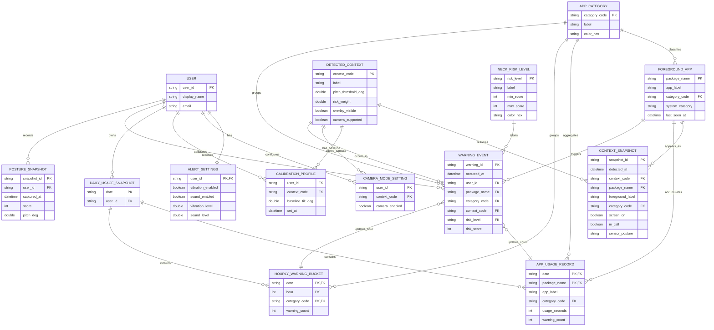

# 포스처가드 논리 ERD

현재 앱은 서버 DB가 아니라 `SharedPreferences` 기반으로 데이터를 저장한다.
따라서 이 ERD는 실제 테이블 구현도가 아니라, `PLAN.md`와 현재 모델 코드를 기준으로 정리한 발표용 논리 ERD이다.

## ERD

## 현재 저장 구조 매핑

| 논리 엔티티 | 현재 구현/저장 위치 |
|---|---|
| `DAILY_USAGE_SNAPSHOT` | `SharedPreferences` key: `usage_history_v1` |
| `APP_USAGE_RECORD` | `DailyUsageSnapshot.apps[]` 내부 JSON |
| `HOURLY_WARNING_BUCKET` | `DailyUsageSnapshot.hourly`, `DailyUsageSnapshot.cat_hourly` |
| `POSTURE_SNAPSHOT` | `SharedPreferences` key: `capture_history_v1` |
| `CALIBRATION_PROFILE` | `posture_calibration_tilt_{mode}`, `posture_calibration_setAt_{mode}` |
| `ALERT_SETTINGS` | `alert_vibration_v1`, `alert_sound_v1`, `alert_vib_level_v1`, `alert_snd_level_v1` |
| `CAMERA_MODE_SETTING` | `camera_in_gaming`, `camera_in_video` |
| `FOREGROUND_APP`, `CONTEXT_SNAPSHOT`, `WARNING_EVENT` | 현재는 주로 런타임 상태/집계로 처리. DB화 시 분리 가능 |

## 발표용 핵심 설명

- 사용자는 앱을 실행하고 센서 측정을 시작한다.
- 포그라운드 앱은 `FOREGROUND_APP`으로 식별되고 `APP_CATEGORY`로 분류된다.
- 포그라운드 앱, 화면 상태, 통화 상태, 센서 자세가 합쳐져 `DETECTED_CONTEXT`가 결정된다.
- 자세 위험이 발생하면 `WARNING_EVENT`가 생기고, 일별/시간대별 리포트 집계에 반영된다.
- 캘리브레이션과 알림, 카메라 설정은 사용자별 설정 데이터로 분리된다.
